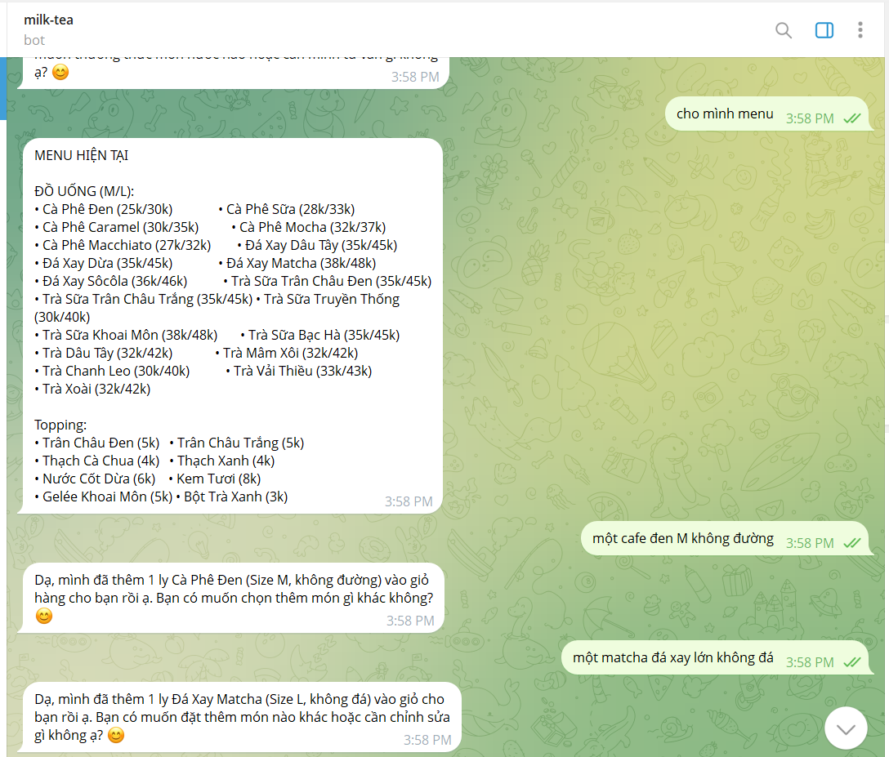
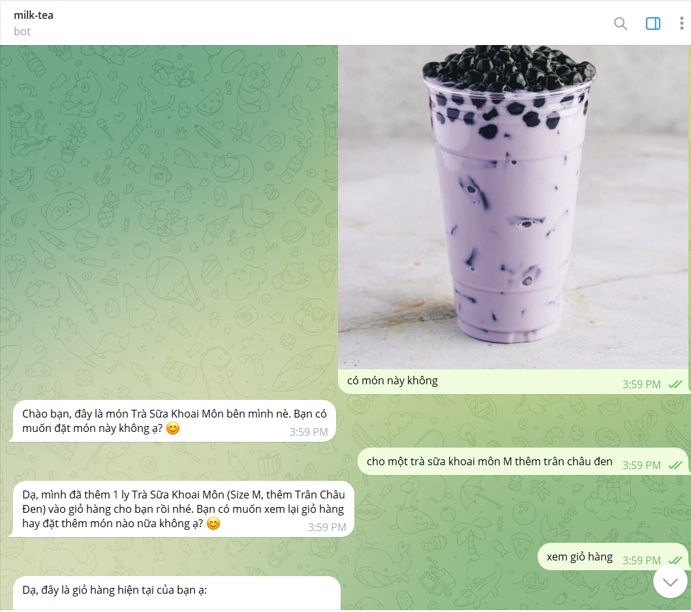
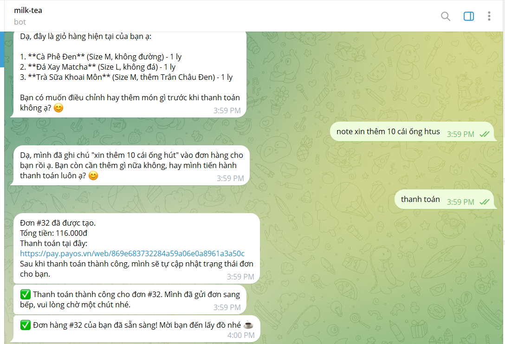
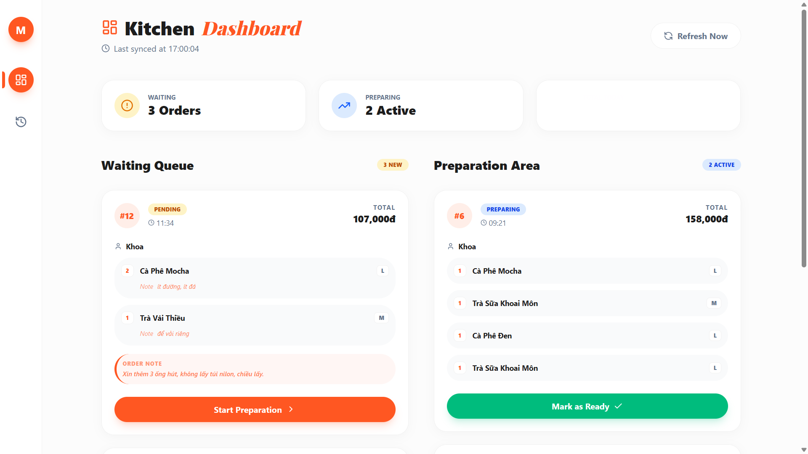
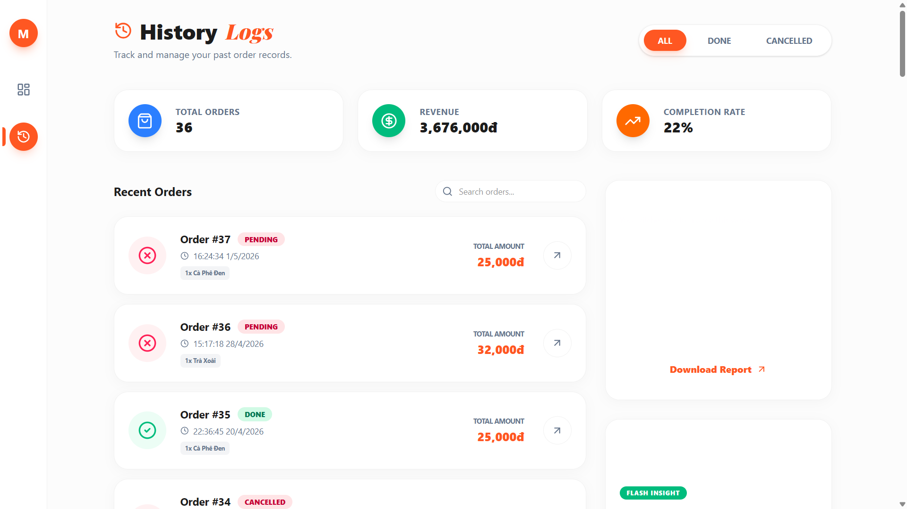

# Milk Tea Bot

An AI-powered milk tea ordering system built as a monorepo. Customers place orders through a Telegram bot, the bot uses Gemini to chat naturally and build the cart, PayOS handles checkout, and a Next.js kitchen dashboard shows incoming orders in real time.

## Overview

This project is split into two applications:

- `backend`: Express API, Telegram bot, Gemini flow, Redis cart/session storage, Prisma database layer, and PayOS webhook handling.
- `frontend`: Next.js kitchen dashboard for viewing and updating orders.

## Features

- AI ordering flow in Telegram with Gemini function calling.
- Menu browsing, cart management, note handling, and checkout support.
- PayOS payment link generation and webhook-based payment confirmation.
- Real-time kitchen dashboard for pending and preparing orders.
- Order history page with filtering and summary stats.
- Dedicated success and cancel pages for payment redirects.

## Tech Stack

### Backend

- Node.js
- Express 5
- Grammy for Telegram bot integration
- Prisma ORM
- PostgreSQL
- Redis via Upstash
- Gemini via `@google/generative-ai`
- PayOS via `@payos/node`

### Frontend

- Next.js 16 App Router
- React 19
- Tailwind CSS 4
- `lucide-react`
- `date-fns`

## Project Structure

```text
milk-tea-bot/
├── backend/
│   ├── csv/
│   ├── prisma/
│   └── src/
│       ├── ai/
│       ├── bot/
│       ├── config/
│       ├── controllers/
│       ├── lib/
│       ├── routes/
│       └── services/
├── frontend/
│   ├── app/
│   ├── components/
│   └── lib/
└── README.md
```

## Screenshots


### Telegram ordering flow





### Kitchen dashboard



### Order history



## Getting Started

### Prerequisites

- Node.js 20 or newer
- A Telegram bot token from BotFather
- A PostgreSQL database
- A Redis instance, such as Upstash
- A PayOS account and API credentials
- An ngrok tunnel or any public HTTPS endpoint for webhooks during local development

### 1. Install dependencies

From the repository root:

```bash
npm install
```

Then install workspace dependencies if needed:

```bash
cd backend
npm install

cd ../frontend
npm install
```

### 2. Configure environment variables

Create a `.env` file inside `backend/` with values similar to the example below:

```env
TELEGRAM_BOT_TOKEN="your_telegram_bot_token"
TELEGRAM_WEBHOOK_SECRET="your_webhook_secret"
ADMIN_API_KEY="your_admin_key"

GEMINI_API_KEY="your_gemini_api_key"
GEMINI_MODEL="gemini-3-flash-preview"

PORT=5000
WEBHOOK_URL="https://your-public-url.example"
FRONTEND_URL="http://localhost:3000"

UPSTASH_REDIS_REST_URL="your_upstash_redis_url"
UPSTASH_REDIS_REST_TOKEN="your_upstash_redis_token"

DATABASE_URL="your_postgres_connection_string"

PAYOS_CLIENT_ID="your_payos_client_id"
PAYOS_API_KEY="your_payos_api_key"
PAYOS_CHECKSUM_KEY="your_payos_checksum_key"
```

### 3. Prepare the database

Run Prisma and seed the menu data from CSV:

```bash
cd backend
npx prisma db push
npm run seed
```

### 4. Start the backend

```bash
cd backend
npm run dev
```

The backend runs on `http://localhost:5000` by default.

### 5. Start the frontend

```bash
cd frontend
npm run dev
```

The dashboard runs on `http://localhost:3000` by default.

## Webhook Setup

To connect Telegram to the local backend, expose port `5000` through ngrok or another HTTPS tunnel, then update `WEBHOOK_URL` in `backend/.env`.

After that, call the protected setup endpoint with the admin key:

```bash
Invoke-WebRequest -Method POST -Uri "https://your-public-url.example/setup-webhook" -Headers @{ "x-admin-key" = "your_admin_key" }
```

## Key Endpoints

- `GET /health` - health check
- `POST /webhook` - Telegram webhook endpoint
- `POST /setup-webhook` - registers the Telegram webhook
- `POST /payos/webhook` - PayOS payment callback
- `GET /api/orders` - current kitchen orders
- `GET /api/orders/history` - order history
- `PATCH /api/orders/:id/status` - update order status

## Demo Flow

1. Open the Telegram bot and start a conversation.
2. Ask for the menu, add items to the cart, and include any notes or customizations.
3. Confirm the order to receive a PayOS payment link.
4. Complete the payment.
5. Open the kitchen dashboard and watch the order appear in the pending queue.