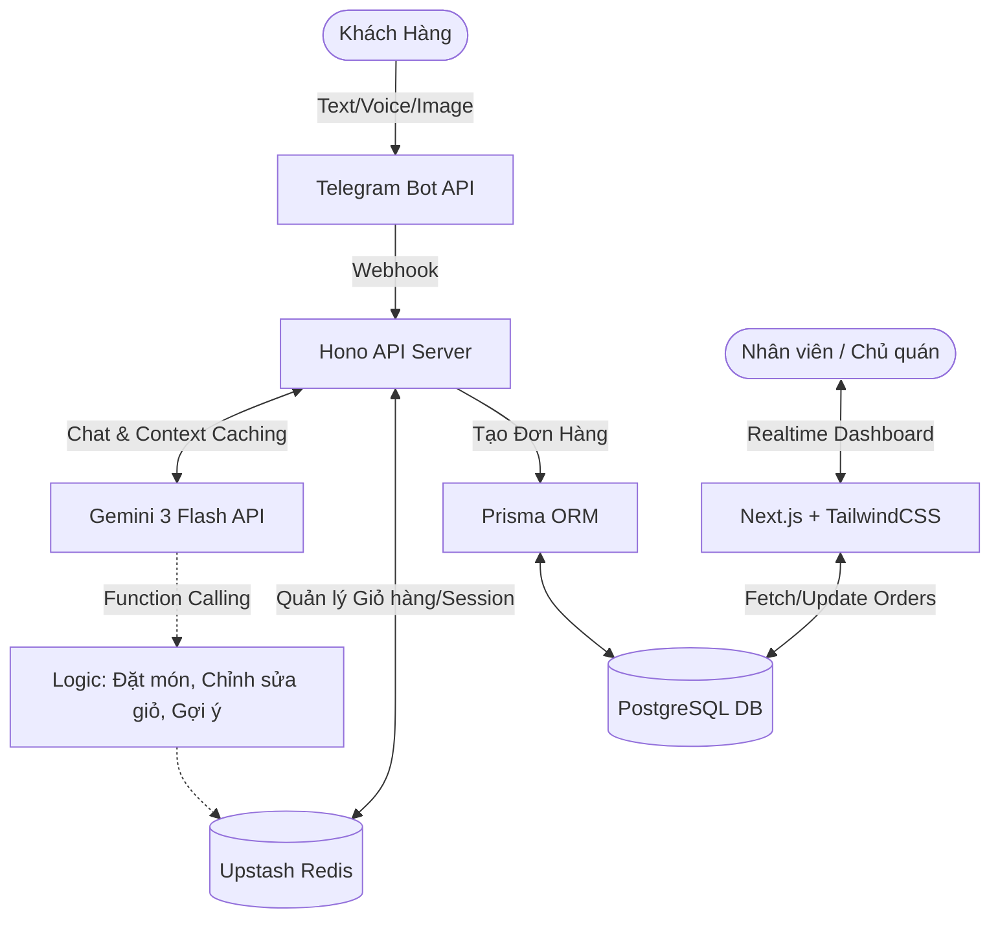

# Kế Hoạch Chi Tiết Xây Dựng AI Chatbot Đặt Trà Sữa (Update 2026)

Tài liệu này là bản kế hoạch phân rã công việc (WBS - Work Breakdown Structure) cực kỳ chi tiết, được xây dựng dựa trên lộ trình 10 tuần. Bản kế hoạch giúp định hướng rõ ràng các task cần thiết, cấu trúc hệ thống và kết quả đầu ra từng giai đoạn.

---

## 📌 Sơ Đồ Kiến Trúc Hệ Thống (Architecture Overview)



---

## 📁 Cấu Trúc Thư Mục Dự Án (Dự Kiến)

```text
milk-tea-agent/
├── src/
│   ├── config/          # Load biến môi trường (.env), cấu hình các API Key
│   ├── bot/             # Logic kết nối Telegram (webhook, commands)
│   ├── ai/
│   │   ├── gemini.ts    # Khởi tạo SDK @google/generative-ai
│   │   ├── tools.ts     # Các schemas & function declarations cho Gemini
│   │   └── prompts.ts   # System prompts & Context caching logic
│   ├── services/
│   │   ├── cart.ts      # Logic tương tác Upstash Redis (thêm/sửa/xóa)
│   │   └── order.ts     # Logic tương tác Prisma Database (chốt đơn)
│   ├── prisma/          # Schema.prisma file cho DB
│   └── index.ts         # Entry point (Khởi tạo Hono server, router)
├── dashboard/           # Thư mục riêng cho trang Kitchen Dashboard (Next.js)
├── .env
├── package.json
└── tsconfig.json
```

---

## 🚀 Giai đoạn 1: Nền Tảng Bot & Trí Tuệ Nhân Tạo (Tuần 1 - Tuần 2)

**Mục tiêu:** Cấu hình thành công đường truyền từ Telegram -> Node.js -> Gemini, bot có khả năng trò chuyện lưu loát về Menu và nhận diện hình ảnh đồ uống.

### Tuần 1: Setup Infrastructure & Kết Nối Telegram
* **T1.1:** Khởi tạo dự án pnpm, cài đặt TypeScript, Hono, GramJS (hoặc Telegraf/Grammy.js).
* **T1.2:** Lấy Token từ `@BotFather`, đăng ký Webhook URL tới server Hono.
* **T1.3:** Setup Cloudflare Tunnel/Ngrok để test Webhook trực tiếp ở máy local.
* **T1.4:** Tạo bộ xử lý lệnh cơ bản (`/start`, `/help`, `/menu`).
* **Deliverable:** Nhắn tin cho bot, bot phản hồi tin nhắn cứng (hardcode) qua Webhook thành công với độ trễ < 500ms.

### Tuần 2: Tích Hợp Gemini 3 & Context Caching
* **T2.1:** Cài đặt `@google/generative-ai` và lấy mảng JSON Menu (Tên món, Giá, Topping, Trạng thái hết hàng).
* **T2.2:** Viết **System Instruction** định hình persona của Bot: *"Bạn là một nhân viên phục vụ quán trà sữa thân thiện..."*.
* **T2.3:** Tích hợp **Context Caching API** của Gemini để nạp trước (preload) Menu List khổng lồ của quán, giúp bot không cần truyền lại menu mỗi lần user chat.
* **T2.4:** Xử lý **Multimodal (Hình ảnh):** Cho phép bot nhận file ảnh khách gửi (vd: ly hồng trà) và dùng Gemini để phân tích ảnh là món gì trong menu.
* **Deliverable:** Khách hàng có thể hỏi đáp tự do với bot về menu quán, tư vấn món dựa trên khẩu vị.

---

## 🛒 Giai đoạn 2: Trải Nghiệm Đặt Hàng Thông Minh (Tuần 3 - Tuần 4)

**Mục tiêu:** Xử lý nghiệp vụ đặt đồ ăn thông qua LLM (Function Calling/Structured Outputs) và duy trì state giỏ hàng.

### Tuần 3: Định nghĩa Tool/Function Calling
* **T3.1:** Định义 các tool functions bằng JSON Schema (sử dụng thư viện `zod` để map).
  - `addToCart(itemName, size, toppings, note, quantity)`
  - `removeFromCart(itemId)`
  - `viewCart()`
* **T3.2:** Khai báo Tool Objects vào mô hình Gemini. Bắt các event LLM cần gọi hàm, thực thi code TypeScript tương ứng và trả kết quả hàm lại cho LLM (Tool Message).
* **Deliverable:** Khi khách gõ "Cho chị 2 cốc lục trà không đá", hệ thống tự nhận diện và gọi hàm `addToCart` chính xác thông số.

### Tuần 4: Quản Lý State với Redis
* **T4.1:** Thiết lập Upstash Redis (serverless, low-latency).
* **T4.2:** Viết các service `cart.service.ts`: `setSession`, `getCart`, `updateItem`, với key là `telegram_user_id`.
* **T4.3:** Xử lý các edge cases phức tạp như: Khách đổi ý liên tục (Sửa size, thêm bớt topping), ép bot confirm (xác nhận) đơn hàng trước khi chốt.
* **Deliverable:** Giỏ hàng mượt mà, khách có thể kiểm tra giỏ hàng bất cứ lúc nào, tắt app mở lại không bị mất đồ đã chọn.

---

## 📊 Giai đoạn 3: Database Core & Kitchen Dashboard (Tuần 5 - Tuần 7)

**Mục tiêu:** Lưu trữ đơn hàng ổn định và cung cấp giao diện hiển thị cho nhân viên pha chế.

### Tuần 5: Thiết kế Database & Prisma ORM
* **T5.1:** Đăng ký PostgreSQL (Supabase/Neon).
* **T5.2:** Khởi tạo `prisma init`. Định nghĩa cấu trúc `schema.prisma`:
  - Bảng `User` (Telegram_ID, Name, Phone).
  - Bảng `Order` (ID, UserID, TotalPrice, Status: PENDING, PREPARING, DONE, CANCELLED).
  - Bảng `OrderItem` (OrderID, Product Name, Toppings, Note).
* **T5.3:** Móc nối luồng xác nhận chốt đơn từ Bot (Phase 2) -> Lưu xuống Database qua Prisma.
* **Deliverable:** Đơn hàng từ Telegram sinh ra dữ liệu thật trong Database.

### Tuần 6: Xây Dựng Kitchen Dashboard
* **T6.1:** Khởi tạo thư mục `dashboard/` bằng Next.js + TailwindCSS + Shadcn/UI.
* **T6.2:** Dựng giao diện Kanban Board hoặc Grid hiển thị Ticket. Mỗi ticket chứa thông tin món + ghi chú.
* **T6.3:** Dựng API pull dữ liệu Order thông qua Next.js Server Actions hoặc tRPC.

### Tuần 7: Realtime & Analytics Backend
* **T7.1:** Tích hợp Realtime (Supabase Realtime Channel hoặc Polling tối ưu qua SWR/React Query). Khi có đơn từ Telegram, Dashboard tự chớp/báo âm thanh và hiện đơn mới không cần F5.
* **T7.2:** Thêm nút chuyển trạng thái trên Dashboard (Ví dụ: Bấm "Xong" -> Bắn API đẩy trạng thái tới webhook Hono -> Webhook gửi tin nhắn Telegram báo khách tới lấy đồ).
* **Deliverable:** Nhân viên theo dõi đơn bếp realtime, khách theo dõi được trạng thái ly trà sữa đổi màu (Chuẩn bị -> Đã xong).

---

## 🤖 Giai đoạn 4: Personal Agent & Nâng Cấp Trải Nghiệm (Tuần 8 - Tuần 10)

**Mục tiêu:** Biến Bot từ dạng công cụ thành một người bạn thấu hiểu hành vi của khách hàng, đem lại Wow-effect.

### Tuần 8: Long-term Memory (Trí nhớ dài hạn)
* **T8.1:** Cài đặt pgvector vào PostgreSQL hoặc sử dụng Pinecone.
* **T8.2:** Khi có order thành công, extract các keywords (Vd: "Thích uống ngọt", "Dị ứng trân châu đen") và lưu dưới dạng vector/embedding.
* **T8.3:** Quá trình tư vấn: Vector Search tìm thông tin cũ của khách -> Đưa lên context prompt. (VD: "Nay chị vẫn uống trà lài nhiều ngọt như hôm thứ 3 chứ ạ?").

### Tuần 9: Agentic Workflow & Quản lý Kho Hàng
* **T9.1:** Kết nối file Google Sheet kiểm tra nguyên liệu realtime với tool calling.
* **T9.2:** Tự động hóa tình huống khách đặt món A nhưng hết hàng -> Agent tự truy xuất các món tương tự và gợi ý món B bù vào ngay trong luồng hội thoại.

### Tuần 10: Tinh Chỉnh Cuối Cùng & Triển Khai (Go Live)
* **T10.1:** Deploy Webhook Server lên Cloudflare Workers hoặc Vercel Edge.
* **T10.2:** Deploy Database lên môi trường Production (Scale plan).
* **T10.3:** Deploy Kitchen Dashboard.
* **T10.4:** Write automation test cho luồng đặt hàng. Lên kế hoạch marketing/chạy bộ data mồi.
* **Deliverable:** Hệ thống sẵn sàng cho 1000+ users đồng thời.

---

> **Lưu ý Quan Trọng Về Công Nghệ (2026):** Gemini 3 Flash đã cải thiện vượt bậc về khả năng giữ JSON Scheme Format và tốc độ. Hãy tận dụng tối đa `response_schema` mode thay vì prompt text thô để giảm thiểu try/catch errors trong code. Bằng cách dùng Hono trên serverless edge, kết nối của bot Telegram sẽ cực kỳ nhẹ và giá rẻ.